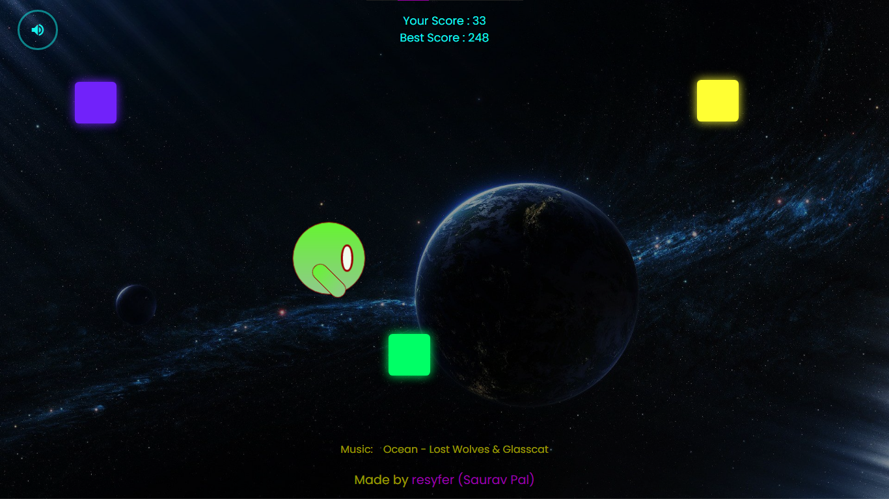
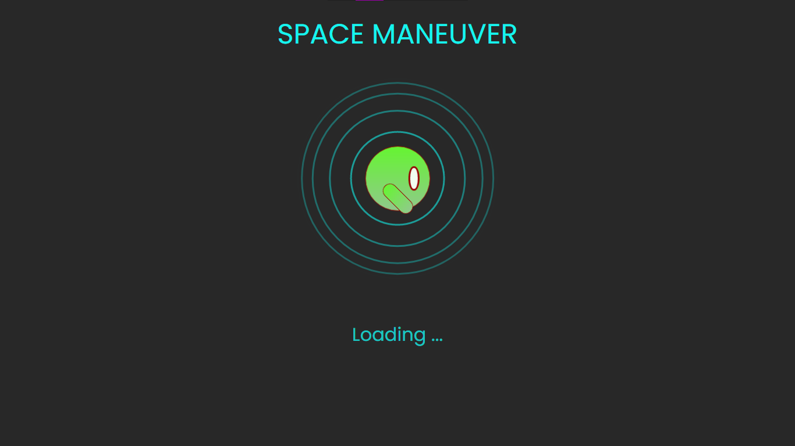
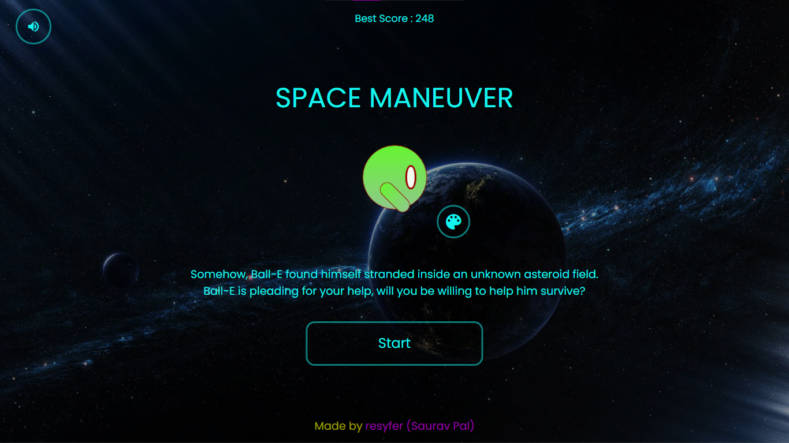

# cyberbot_4.0-tecnoesis-nits
Team Members: Saurav Pal (resyfer)

[Project Website Link](https://resyfer-cyberbot-4.netlify.app/)

My project for Cyberbot 4.0 for Tecnoesis, National Institute of Technology, Silchar 2021

## About
Ball-E is a friendly but clumsy robot who found himself stranded in the middle of an unknown asteroid belt in outer space. Ball-E wants to survive. Will you be willing to help him?

### Dodge the boulders

  <code></code>
  <code></code>
  <code></code>
    
  Dodge the boulders. You better be fast since the boulders just keep on increasing! Over that, they just keep coming faster 😱😭

### Change Ball-E's Color to your liking

  <code></code>
  <code></code>
  <code></code>
  <code></code>
  <code></code>

### Groove to music while you dodge

  <code></code>
    
  Ball-E wants you to be comfortable while you're helping him, so he plays you some songs. Groove to music while you dodge the boulders. You don't have to worry about changing the song, Ball-E does that for you!

